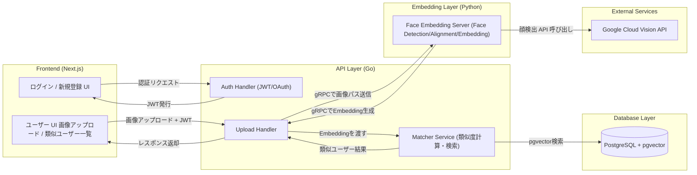

# Destiny Face 顔マッチングサービス — 仕様書

## 概要
本サービス「Destiny Face」は、心理学と顔認証技術を融合させた新しいプラットフォームです。人は自分に似た属性を持つ相手に好意を持ちやすい（類似性の法則）」や「単純接触効果」といった心理学的アプローチに基づき、ユーザーの顔画像から生物学的に相性の良い人を検出、マッチングさせます。
技術的には、顔特徴抽出に Python、高負荷なアプリケーションロジックとチャット機能に Go を採用し、両者を gRPC で接続するマイクロサービス構成をとります。プロントエンドにはNext.js+TypeScriptで構成します。

# 1.要件サマリ
## 機能 (MVP)
- 認証: ユーザー登録/ログイン (JWT/OAuth)
- 運命のツイン検索 (基本):
    - 自分の顔画像をアップロードし、特徴量(embedding)を生成・保存。
    - コサイン類似度に基づく類似ユーザー検索。

- タイプ検索 (収益化機能):
    - 「推し」や「元恋人」の画像をアップロードし、その顔に似ている会員を探す機能。
    - セキュリティ: 検索用画像は特徴量抽出後に即時破棄する。

- コミュニケーション(ツインやタイプでも互いにいいねを押したらチャット可能に！):
    - WebSocketを用いたリアルタイムチャット。

# 2. 全体図


# 3. ディレクトリ構成
```
go-backend/
├── cmd/
│   └── api/
│       └── main.go           # エントリーポイント (DI、ルーティング設定、サーバー起動)
├── internal/
│   ├── domain/               # ビジネスロジックの中心 (外部ライブラリに依存しない)
│   │   ├── entity/           # エンティティ & 値オブジェクト
│   │   │   ├── user.go       # User Entity, UserId ValueObject
│   │   │   └── face.go       # FaceEmbedding ValueObject
│   │   ├── repository/       # リポジトリの「インターフェース」定義
│   │   │   ├── user_repo.go
│   │   │   └── face_repo.go
│   │   └── service/          # ドメインサービス (純粋なドメインロジックがあれば)
│   │       └── similarity.go # 例: 類似度判定の閾値ロジックなど
│   │
│   ├── usecase/              # アプリケーションロジック
│   │   ├── user_usecase.go   # "ユーザー登録する" などの処理フロー
│   │   ├── match_usecase.go  # "画像を元に類似ユーザーを探す" フロー
│   │   └── inputport/        # UseCaseへの入力データの定義 (DTO的な役割)
│   │
│   ├── controller/            # 入出力の変換 (Controller/Presenter)
│   │   ├── http/             # REST API ハンドラ (Echo/Ginなど)
│   │   │   ├── handler.go
│   │   │   ├── request.go    # JSONリクエストの構造体
│   │   │   └── response.go   # JSONレスポンスの構造体
│   │   └── websocket/        # チャット用 WebSocket ハンドラ
│   │
│   └── infrastructure/       # 技術的な詳細実装 (DB, 外部API)
│       ├── persistence/      # リポジトリの実装、永続化処理 (PostgreSQL + pgvector)
│       │   ├── db.go
│       │   ├── user_repo_impl.go
│       │   └── face_repo_impl.go
│       ├── grpc/             # PythonサービスへのgRPCクライアント実装
│       │   └── face_client.go
│       └── router/           # Webフレームワークのルーティング設定
│
├── pkg/                      # プロジェクト外でも使える汎用ユーティリティ (Logger, Errorなど)
├── api/                      # gRPCの .proto ファイル定義
│   └── proto/
│       └── face_service.proto
├── go.mod
└── go.sum
```

<!-- websocketによるチャット機能をfrontendのflowchart LR追加する -->

# 4. 処理の流れ
### ① Frontend → Go API
Next.jsから画像をアップロードする

### ② Go → Python (gRPC)
画像をGo APIからPythonサーバへ送る。
Pythonは以下のものを担当する。
- 顔検出（Vision API）
- 顔前処理 (アライメント)
- 512次元 embedding 抽出

### ③ Python → Go (gRPC)
PythonからembeddingをGoに返す。

### ④ 類似度検索をGoが行う
- embedding を受け取り
- pgvector で類似検索
- コサイン類似度でスコア算出する
- 類似ユーザー一覧を返却する

### ⑤ Go → Frontend
結果 (似ているユーザー)を返す。

# 5. アーキテクチャ詳細 (クリーンアーキテクチャ & DDD の採用)


# 6. フロントエンド仕様 (Next.js+TypeScript)
## 主要ページ
- /singup, /login：認証画面。
- /profile：プロフィール編集 (名前、写真、公開範囲)
- /upload：顔写真アップロード
- /matches：類似ユーザー一覧 (スコア、サムネイル、チャットボタン)
- /chat/[userId]：チャット画面

## なぜNext.jsを採用するか、Reactとの比較

## TypeScriptを採用する理由

# 7. バックエンド仕様 (Go)
## GolangとPythonの比較

<!-- あとで詳細図で別に飛ばす -->
# 8. 顔認証/顔類似性サービス (Python)

<!-- あとで詳細図で別に飛ばす -->
# 9. API仕様書 (REST for frontend, gRPC for service間)

<!-- あとで詳細図で別に飛ばす -->
# 10. DBデータモデル


